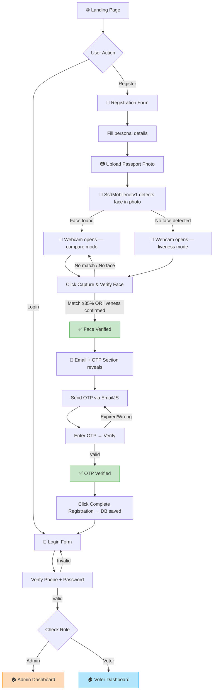
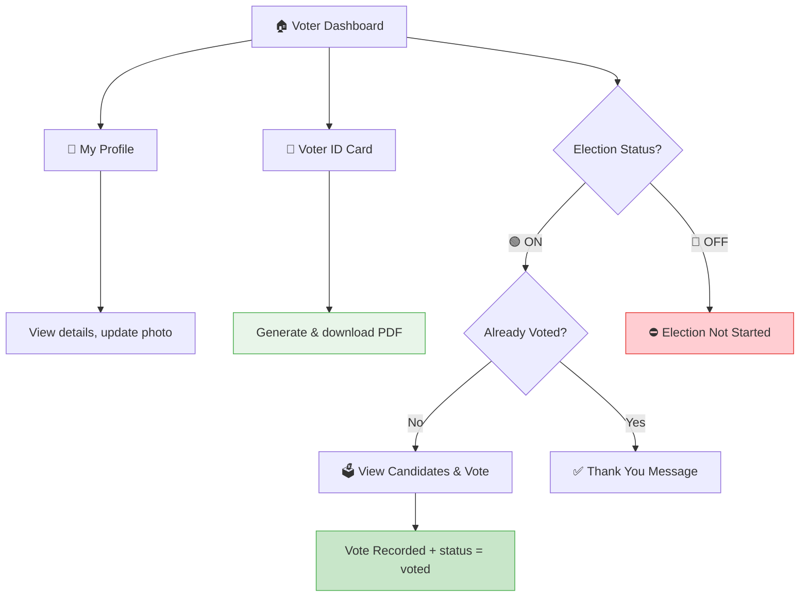
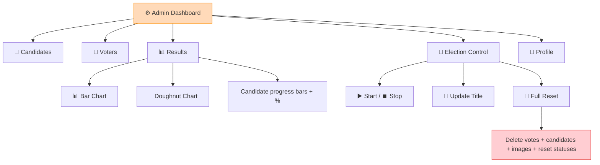

# 🗳️ Online Voting System

A secure, feature-rich, web-based voting platform built with **PHP**, **MySQL**, and **XAMPP**. Designed for conducting transparent elections with a full-featured **Admin Panel**, an intuitive **Voter Dashboard**, **Email OTP Verification**, **Face Recognition** identity check, **PDF Voter ID Card** generation, and **live Chart.js election results**.

> 🏛️ *Built for Election Commission of India – MLA Elections*

---

## ✨ Features

### 🔐 Authentication & Security
- Phone number & password-based login
- **Dual-Model Face Recognition** during registration — `SsdMobilenetv1` analyses the uploaded passport photo; `TinyFaceDetector` scans the live webcam feed; both powered by `face-api.js` (no API key needed)
- **Webcam-only liveness fallback** — if the passport photo face detection fails, the system automatically switches to a liveness-only check to keep registration flowing
- **Email OTP Verification** — 6-digit OTP with 5-minute countdown timer via EmailJS
- Server-side OTP cross-check in MySQL before registration completes
- `bcrypt` password hashing (`password_hash`)
- Role-based access control (**Admin** / **Voter**)
- Session-based authentication with auto-redirect

### 👤 Voter Portal
- **Smart Registration Form** with step-by-step verification:
  1. Fill personal details
  2. Upload passport photo → **face detected automatically**
  3. Webcam opens → `SsdMobilenetv1` compares face against uploaded photo (fallback: liveness-only check if photo detection fails)
  4. On match (≥35% similarity / distance < 0.65) → Email/OTP section reveals
  5. Verify OTP → Submit registration
- **Voter Dashboard** with voting status, election status, and quick-action cards
- **My Profile Page** — view all personal details, update photo, download Voter ID
- **PDF Voter ID Card** — credit-card sized ID generated and downloaded using `jsPDF`
- **Vote Page** — shows candidates only when election is active
- "Election Not Started" message when closed
- One-person-one-vote enforcement

### ⚙️ Admin Panel
- **Dashboard** with live stats — Registered Voters, Candidates, Votes Cast, Turnout %
- **Results Page** (locked while election is active — results only visible after election ends):
  - 🔒 **"Results Are Locked"** screen during active voting
  - 🏆 **Animated Winner Popup** — auto-appears with winner's photo, name, party & vote share
  - Animated **Bar Chart** (vote distribution)
  - Animated **Doughnut Chart** (vote share percentage)
  - Candidate progress bars with vote percentages
  - Total votes banner
  - 🏆 Winner badge on leading candidate
- **Candidate Management** — Add, Edit, Delete with photo & manifesto
- **Voter Management** — View all voters (with email), Remove voters
- **Election Control** — Start/Stop election, Update custom title, Full Reset
- **Admin Profile Page** — view details, update profile photo, logout

### 🎨 UI/UX
- **Glassmorphism** design with frosted-glass buttons
- Role-based color themes:
  - 🟠 **Login/Register** → Sunshine Orange gradient
  - 🍑 **Admin pages** → Peach gradient
  - 🔵 **Voter pages** → Light Blue gradient
- Smooth animations & hover effects
- Google Fonts (Outfit)
- Fully responsive layout

---

## 🛠️ Tech Stack

| Layer | Technology |
|-------|-----------|
| **Frontend** | HTML5, CSS3, Vanilla JavaScript |
| **Backend** | PHP 8+ (MySQLi) |
| **Database** | MySQL via XAMPP |
| **Server** | XAMPP (Apache + MySQL) |
| **Face Recognition** | face-api.js `@vladmandic` v1.7.13 — `SsdMobilenetv1` (photo) + `TinyFaceDetector` (webcam) |
| **Email OTP** | EmailJS SDK v4 (free: 200 emails/month) |
| **Charts** | Chart.js v4.4 (CDN, no API key) |
| **PDF Generation** | jsPDF v2.5 (CDN, no API key) |
| **Fonts** | Google Fonts – Outfit |
| **Design** | Glassmorphism, CSS Gradients, CSS Variables |

---

## 🔄 Application Flowchart

### Overall System Flow



### Voter Workflow



### Admin Workflow



---

## 🗂️ Project Structure

```
Online_voting/
│
├── index.html              # 🔐 Login & Registration (Face → OTP → Submit)
├── login.php               # 🔑 Login authentication handler
├── register.php            # 📥 Registration handler (face + OTP + DB)
├── logout.php              # 🚪 Session destroy & redirect
│
├── generate_otp.php        # 🔑 API: Generates 6-digit OTP & stores in DB
├── verify_otp.php          # ✅ API: Verifies OTP code + expiry check
├── setup_otp_table.php     # 🗄️ One-time: creates otp_verification table
├── add_face_column.php     # 🗄️ One-time: adds face_verified column to users
│
├── profile.php             # 👤 Profile page (voter + admin) with photo upload + PDF ID
├── dashboard.php           # 🏠 Voter dashboard with quick-action cards
├── vote.php                # 🗳️ Voting page (candidates when election ON)
├── submit_vote.php         # ✅ Vote submission handler
│
├── admin_dashboard.php     # ⚙️ Admin dashboard with live stats
├── candidates.php          # 👥 Manage candidates (list view)
├── add_candidate.php       # ➕ Add candidate form
├── edit_candidate.php      # ✏️ Edit candidate form
├── delete_candidate.php    # 🗑️ Delete candidate + image
├── manage_voters.php       # 👥 View & remove voters (with email column)
├── delete_voter.php        # 🗑️ Remove voter + cleanup votes
├── results.php             # 📊 Results with Bar Chart + Doughnut Chart (Chart.js)
│
├── toggle_election.php     # 🚦 Start/Stop election status
├── update_title.php        # 💾 Update election title
├── reset.php               # 🔄 Full election wipe
├── get_title.php           # 📡 API: Returns election title as JSON
│
├── config.php              # 🔌 MySQL database connection
├── navbar.php              # 🧭 Dynamic navbar + role-based background
├── hash.php                # 🔑 bcrypt password hash generator
│
├── style.css               # 🎨 Full stylesheet (glassmorphism, gradients, animations)
├── script.js               # ⚡ Face recognition + OTP + EmailJS logic
│
├── uploads/                # 🖼️ Voter passport photos & profile images
└── assets/                 # 📁 Static assets
```

---

## 🗄️ Database Schema (5 Tables)

### Database: `online_voting`

#### `users` Table
| Column | Type | Description |
|--------|------|-------------|
| `id` | INT (PK, AI) | User ID |
| `name` | VARCHAR(100) | Full name |
| `phone` | VARCHAR(15) | Phone number (unique) |
| `email` | VARCHAR(255) | Email (used for OTP) |
| `aadhaar` | VARCHAR(12) | Aadhaar (unique, 12 digits) |
| `address` | TEXT | Residential address |
| `password` | VARCHAR(255) | bcrypt hashed password |
| `role` | ENUM('voter','admin') | User role |
| `image` | VARCHAR(255) | Profile/passport photo path |
| `status` | VARCHAR(20) | `approved` / `voted` |
| `face_verified` | TINYINT(1) | 1 = face matched during registration |

#### `otp_verification` Table
| Column | Type | Description |
|--------|------|-------------|
| `id` | INT (PK, AI) | OTP record ID |
| `email` | VARCHAR(255) | Email address |
| `otp_code` | VARCHAR(6) | 6-digit OTP |
| `created_at` | DATETIME | When generated |
| `expires_at` | DATETIME | Expiry (5 min after creation) |
| `is_verified` | TINYINT(1) | 0 = pending, 1 = verified |

> 🧹 OTP records are deleted automatically after successful registration.

#### `candidates` Table
| Column | Type | Description |
|--------|------|-------------|
| `id` | INT (PK, AI) | Candidate ID |
| `name` | VARCHAR(100) | Candidate name |
| `party` | VARCHAR(100) | Political party |
| `manifesto` | TEXT | Election manifesto |
| `image` | VARCHAR(255) | Candidate photo path |

#### `votes` Table
| Column | Type | Description |
|--------|------|-------------|
| `id` | INT (PK, AI) | Vote ID |
| `user_id` | INT (FK) | Voter (→ users.id) |
| `candidate_id` | INT (FK) | Candidate (→ candidates.id) |

#### `settings` Table
| Column | Type | Description |
|--------|------|-------------|
| `id` | INT (PK) | Always 1 |
| `election_status` | ENUM('ON','OFF') | Election active status |
| `election_title` | VARCHAR(255) | Custom election title |

---

## 🚀 Installation & Setup

### Prerequisites
- [XAMPP](https://www.apachefriends.org/) (Apache + MySQL)
- PHP 8.0+
- Modern browser (Chrome/Edge recommended for webcam)
- Internet access (for CDN libraries: face-api.js, Chart.js, jsPDF, EmailJS)
- Free [EmailJS account](https://www.emailjs.com)

### Steps

**1. Place project in htdocs**
```
C:\xampp\htdocs\Online_voting\
```

**2. Start XAMPP** — Start both **Apache** and **MySQL**

**3. Create Database** — Open [phpMyAdmin](http://localhost/phpmyadmin):

```sql
CREATE DATABASE online_voting;
USE online_voting;

CREATE TABLE users (
    id INT AUTO_INCREMENT PRIMARY KEY,
    name VARCHAR(100) NOT NULL,
    phone VARCHAR(15) UNIQUE NOT NULL,
    email VARCHAR(255),
    aadhaar VARCHAR(12) UNIQUE NOT NULL,
    address TEXT,
    password VARCHAR(255) NOT NULL,
    role ENUM('voter','admin') DEFAULT 'voter',
    image VARCHAR(255),
    status VARCHAR(20) DEFAULT 'approved',
    face_verified TINYINT(1) DEFAULT 0
);

CREATE TABLE otp_verification (
    id INT AUTO_INCREMENT PRIMARY KEY,
    email VARCHAR(255) NOT NULL,
    otp_code VARCHAR(6) NOT NULL,
    created_at DATETIME DEFAULT CURRENT_TIMESTAMP,
    expires_at DATETIME NOT NULL,
    is_verified TINYINT(1) DEFAULT 0
);

CREATE TABLE candidates (
    id INT AUTO_INCREMENT PRIMARY KEY,
    name VARCHAR(100) NOT NULL,
    party VARCHAR(100),
    manifesto TEXT,
    image VARCHAR(255)
);

CREATE TABLE votes (
    id INT AUTO_INCREMENT PRIMARY KEY,
    user_id INT NOT NULL,
    candidate_id INT NOT NULL,
    FOREIGN KEY (user_id) REFERENCES users(id),
    FOREIGN KEY (candidate_id) REFERENCES candidates(id)
);

CREATE TABLE settings (
    id INT PRIMARY KEY DEFAULT 1,
    election_status ENUM('ON','OFF') DEFAULT 'OFF',
    election_title VARCHAR(255) DEFAULT 'Online Voting System'
);

INSERT INTO settings VALUES (1, 'OFF', 'Online Voting System');
```

**4. Create Admin User**
- Visit `http://localhost/Online_voting/hash.php` → generates bcrypt hash
- Run in phpMyAdmin:
```sql
INSERT INTO users (name, phone, password, role, status)
VALUES ('Admin', '9999999999', 'PASTE_HASH_HERE', 'admin', 'approved');
```

**5. Configure EmailJS**
- Sign up at [emailjs.com](https://www.emailjs.com) → free: 200 emails/month
- Create Gmail **Email Service** → copy **Service ID**
- Create **Email Template** with:
  - **To Email**: `{{email}}`
  - Body must include `{{passcode}}` (the OTP code)
- Copy **Template ID** and **Public Key**
- Update `script.js` lines 80–82:
```js
const EMAILJS_PUBLIC_KEY  = "YOUR_PUBLIC_KEY";
const EMAILJS_SERVICE_ID  = "YOUR_SERVICE_ID";
const EMAILJS_TEMPLATE_ID = "YOUR_TEMPLATE_ID";
```

**6. Run One-Time Setup Scripts**

Visit these URLs once in your browser:
```
http://localhost/Online_voting/setup_otp_table.php  ← Creates OTP table
http://localhost/Online_voting/add_face_column.php  ← Adds face_verified column
```

**7. Access the Application**
```
http://localhost/Online_voting/
```

---

## 🔒 Security Features

| Feature | Status |
|---------|--------|
| Dual-model face recognition (`SsdMobilenetv1` photo + `TinyFaceDetector` webcam) | ✅ |
| Webcam-only liveness fallback if photo detection fails | ✅ |
| Email OTP with 5-min expiry | ✅ |
| Server-side OTP DB cross-check | ✅ |
| OTP records purged after registration | ✅ |
| bcrypt password hashing | ✅ |
| Session-based authentication | ✅ |
| Role-based page protection | ✅ |
| Double-vote prevention | ✅ |
| Election status enforced server-side | ✅ |
| Results hidden during active election | ✅ |
| Voter removal with vote cleanup | ✅ |
| Face verification flag stored in DB | ✅ |
---

## 📋 Roadmap

- [x] ~~Email OTP verification~~ ✅
- [x] ~~Face recognition for voter identity~~ ✅
- [x] ~~Voter & Admin Profile Pages~~ ✅
- [x] ~~Profile photo upload~~ ✅
- [x] ~~PDF Voter ID Card generation~~ ✅
- [x] ~~Chart.js live results (bar + doughnut)~~ ✅
- [x] ~~Voter removal by admin~~ ✅
- [x] ~~Full election reset~~ ✅
- [x] ~~Role-based color themes~~ ✅
- [x] ~~Glassmorphism UI~~ ✅
- [ ] Audit logs for admin actions
- [ ] Multi-election / multi-constituency support
- [ ] SMS OTP fallback (Twilio)
- [ ] Dark mode toggle
- [x] Voter ID card QR code
- [x] ~~Dual-model face recognition (SsdMobilenetv1 + TinyFaceDetector)~~ ✅
- [x] ~~Webcam-only liveness fallback~~ ✅
- [x] ~~Results locked during active election~~ ✅
- [x] ~~Winner announcement popup~~ ✅

---

## 🤝 Contributing

1. Fork the repository
2. Create your feature branch: `git checkout -b feature/AmazingFeature`
3. Commit: `git commit -m 'Add AmazingFeature'`
4. Push: `git push origin feature/AmazingFeature`
5. Open a Pull Request

---

## 📄 License

Licensed under the **MIT License** — see the [LICENSE](LICENSE) file for details.

---

<div align="center">

**Made with ❤️ for transparent & secure elections**

⭐ *Star this repo if you found it useful!* ⭐

</div>
